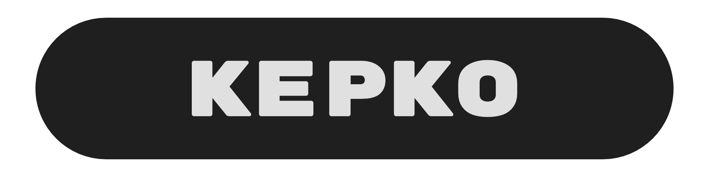

[](https://central.sonatype.com/artifact/glass.yasan.kepko/core) [](LICENSE) [](https://github.com/yasanglass/kepko/actions/workflows/android.yml) [](https://github.com/yasanglass/kepko/actions/workflows/jvm.yml) [](https://github.com/yasanglass/kepko/actions/workflows/ios.yml) [](https://github.com/yasanglass/kepko/actions/workflows/js.yml) [](https://github.com/yasanglass/kepko/actions/workflows/wasm.yml) [](https://github.com/yasanglass/kepko/actions/workflows/detekt.yml) [](https://github.com/yasanglass/kepko/actions/workflows/publish.yml)

A work-in-progress design system for Compose Multiplatform.

## Usage

This library is published on [Maven Central](https://central.sonatype.com/namespace/glass.yasan.kepko). Add the dependencies to your project:

```kotlin
implementation("glass.yasan.kepko:foundation:<version>")
implementation("glass.yasan.kepko:component:<version>")
```

Wrap your app content with `KepkoTheme`:

```kotlin
KepkoTheme {
    Text("Hello, Kepko!")
}
```

## Components

- [Border](compose-multiplatform/component/src/commonMain/kotlin/glass/yasan/kepko/component/Border.kt)
- [Button](compose-multiplatform/component/src/commonMain/kotlin/glass/yasan/kepko/component/Button.kt)
- [Checkbox](compose-multiplatform/component/src/commonMain/kotlin/glass/yasan/kepko/component/Checkbox.kt)
- [HorizontalDivider](compose-multiplatform/component/src/commonMain/kotlin/glass/yasan/kepko/component/HorizontalDivider.kt)
- [Icon](compose-multiplatform/component/src/commonMain/kotlin/glass/yasan/kepko/component/Icon.kt)
- [RadioButton](compose-multiplatform/component/src/commonMain/kotlin/glass/yasan/kepko/component/RadioButton.kt)
- [Slider](compose-multiplatform/component/src/commonMain/kotlin/glass/yasan/kepko/component/Slider.kt)
- [Switch](compose-multiplatform/component/src/commonMain/kotlin/glass/yasan/kepko/component/Switch.kt)
- [Text](compose-multiplatform/component/src/commonMain/kotlin/glass/yasan/kepko/component/Text.kt)
- [TextMono](compose-multiplatform/component/src/commonMain/kotlin/glass/yasan/kepko/component/TextMono.kt)
- [VerticalDivider](compose-multiplatform/component/src/commonMain/kotlin/glass/yasan/kepko/component/VerticalDivider.kt)
